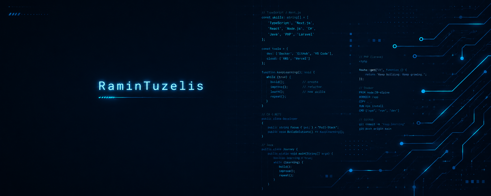

<h1 align="center">RaminTuzelis Portfolio</h1>

<p align="center">
  Personal portfolio of Karolis Mickunas, a programming student and aspiring full stack developer from Lithuania.
</p>

<p align="center">
  <a href="https://ramintuzelis.github.io/">Live website</a>
  &nbsp;|&nbsp;
  <a href="https://ramintuzelis.github.io/#projects">Projects</a>
  &nbsp;|&nbsp;
  <a href="#local-development">Local development</a>
</p>

## About

This portfolio presents my learning journey, academic work, personal projects, certificates, and the technologies I have studied and used. It is built as a lightweight single-page website with HTML, SCSS, and vanilla JavaScript.

The current version focuses on an honest developer identity, responsive design, accessible interactions, and real projects created during my programming studies.

## Highlights

- Responsive single-page layout for desktop, tablet, and mobile screens.
- Dark navy and cyan visual identity built around the RaminTuzelis brand.
- Typewriter hero animation with a mobile-friendly fallback.
- Active navigation state and smooth section scrolling.
- Interactive certificate and project modals.
- Custom contact form validation and Formspree submission.
- Loading, success, server error, and network error states.
- Scroll-to-top control and automatic footer year.

## Portfolio Stack

- HTML5
- SCSS and Dart Sass
- Vanilla JavaScript
- Formspree
- Font Awesome
- Devicon
- Google Fonts
- Prettier
- GitHub Pages

## Local Development

### Requirements

- Git
- Node.js and npm
- A local web server such as the VS Code Live Server extension

### Setup

```bash
git clone https://github.com/Ramintuzelis/ramintuzelis.github.io.git
cd ramintuzelis.github.io
npm install
npm run build:css
```

Open `index.html` with Live Server to run the portfolio locally.

### Development Commands

Watch SCSS and rebuild CSS after every change:

```bash
npm run watch:css
```

Build CSS once:

```bash
npm run build:css
```

Format project files:

```bash
npm run format
```

Check formatting without changing files:

```bash
npm run format:check
```

## Project Structure

```text
ramintuzelis.github.io/
|-- assets/
|   |-- css/
|   |   |-- styles.scss
|   |   `-- styles.css
|   |-- images/
|   `-- js/
|       `-- scripts.js
|-- index.html
|-- package.json
`-- README.md
```

## Contact Form

The contact form uses custom client-side validation before sending data to Formspree. It validates required fields and email format, prevents duplicate submissions while a request is in progress, and displays inline feedback without reloading the page.

## Responsive Design

The layout is tested across desktop, tablet, and mobile widths. The hero typewriter animation remains active while the text fits safely and is disabled on smaller mobile screens where wrapping is needed.

## Status

The portfolio refresh was completed in June 2026. Future updates will focus on adding new projects as they are built and understood, rather than adding placeholder content.

## License

This is a personal portfolio project. No open-source license is currently provided.
